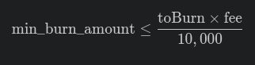

# ICRC2 Token Template

[](https://mops.one)

Template for ICRC2 token implementation with advanced features:
- ✅ Programmable initial distribution
- 🔥 Automatic burning of the set fee percentage.
- 🎚️ Fee percentage management
- 🔒 Temporary token locking

## 📦 Prerequisites
- [Quick Start](https://internetcomputer.org/docs/current/developer-docs/setup/deploy-locally)
- [SDK Developer Tools](https://internetcomputer.org/docs/current/developer-docs/setup/install)
- [Motoko Programming Language Guide](https://internetcomputer.org/docs/current/motoko/main/motoko)
- [Motoko Language Quick Reference](https://internetcomputer.org/docs/current/motoko/main/language-manual)
- [MOPS](https://docs.mops.one/quick-start) (Motoko package manager)
- Node.js (v18+)

🚀 Quick Start

+ Clone repository
` git clone https://github.com/ArielRobotti/ICRC_template
cd ICRC_template  `
+ Install MOPS dependencies
`mops install`

+ Start local replica
`dfx start --background`

## Initial Token Distribution and Locking Periods
##### Tokens assigned in allocatedAmount must be expressed in their fractional unit, i.e., multiplying the token amount by 10 raised to the number of decimals. Example for a token with 8 decimals:
##### 123.5 Tokens are expressed as 123.5 * 10 ** 8 = 12_350_000_000

The initial distribution is defined by a list of categories with the following fields:
+ name // Category name, e.g., team, investors, founders, etc.
+ allocatedAmount // Amount of tokens assigned to each holder
+ holders  // List of beneficiary accounts
+ blockingDays // Total number of lockup days from the time of distribution

Under this scheme, the initial supply is calculated as follows:


## 🛑 Critical Rules to Consider Before Deployment
### 1. Fee Distribution
+ Percentages must be expressed in their standard value multiplied by 100. For example, 1.25% should be indicated as 125.
+ In the deploy parameter fee_distribution_percentages, a list of recipients is defined who will receive a percentage of the fees collected in token transactions. This includes a percentage allocated for burning, explicitly defined in the toBurn field.
+ The sum of all percentages assigned to recipients, plus the burn percentage, must be less than or equal to 100%, which in this system is represented with a maximum of 10_000.

#### Configuration Example
Based on the following deploy parameter configuration:

```
fee_distribution_percentages = record {
    toBurn = 2_500 : nat;
    pooles = vec {
        record {
            name = "Rewards";  
            account = record {
                owner = principal "abcde-hijkl....";
                subaccount = null
            };
            percent = 250
        };
        record {
            name = "Team";  
            account = record {
                owner = principal "abcde-hijkl....";
                subaccount = null
            };
            percent = 250
        };
    };
};
```

We have a fee allocation of 2500 + 250 + 250 = 3000, which equals 30%. The remaining 70% is unassigned, meaning it remains under the control of the fee_collector account.
Regarding these allocations, as of the date of this commit, only the percentage allocated for burning has been implemented, which is executed automatically at the time of each transaction. For this to happen successfully, see the following rule.

### 2. Critical Parameters for the Automatic Fee Burning Mechanism

There are three parameters that determine a successful burning of the percentage of fees allocated for burning:

+ toBurn from the fee_distribution_percentages parameter.
+ min_burn_amount.
+ fee

The relationship that must exist is as follows:



That is, the amount of tokens to be burned in a transaction must be greater than or equal to min_burn_amount; otherwise, they are not burned and remain in the possession of the user who initiated the transaction.

