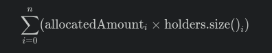
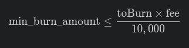

# ICRC2 Token Template 

[](https://mops.one)

Plantilla para implementación de token ICRC2 con características avanzadas:
- ✅ Distribución inicial programable
- 🔥 Quema automática del porcentaje de fee establecido.
- 🎚️ Gestión de porcentajes de fees
- 🔒 Bloqueo temporal de tokens

## 📦 Prerrequisitos
- [Quick Start](https://internetcomputer.org/docs/current/developer-docs/setup/deploy-locally)
- [SDK Developer Tools](https://internetcomputer.org/docs/current/developer-docs/setup/install)
- [Motoko Programming Language Guide](https://internetcomputer.org/docs/current/motoko/main/motoko)
- [Motoko Language Quick Reference](https://internetcomputer.org/docs/current/motoko/main/language-manual)
- [MOPS](https://docs.mops.one/quick-start) (Gestor de paquetes Motoko)
- Node.js (v18+)


🚀 Inicio Rápido

+ Clonar repositorio
` git clone https://github.com/ArielRobotti/ICRC_template
cd ICRC_template  `
+ Instalar dependencias de mops
`mops install`

+ Iniciar réplica local
`dfx start --background`

## Distribucion inicial de tokens y periodos de bloqueos
##### Los tokens asignados en allocatedAmount deben expresarse en su unidad fraccionaria, es decir multiplicando la cantidad de tokens por 10 elevado a la cantidad de decimales. Ejemplo para un token con 8 decimales: 
##### 123.5 Tokens se expresan como 123.5 *10 ** 8 = 12_350_000_000
La distribucion inicial esta definida por una lista de categorias con los siguientes campos. 
+ name // nombre de la categoria. Ej team, investors, founders, etc
+ allocatedAmount // Cantidad de tokens asignada a cada holder
+ holders  // Lista de Accounts beneficiarias
+ blockingDays // Total de dias de bloqueo desde el momento de la distribucion

Bajo este esquema el suministro inicial se calcula a como





## 🛑 Reglas Críticas a considerar antes del deploy
### 1. Distribución de Fees
+ Los porcentajes deben expresarse en su valor estándar multiplicado por 100. Por ejemplo, un 1.25% debe indicarse como 125.
+ En el parámetro de deploy fee_distribution_percentages, se define una lista de destinatarios que recibirán un porcentaje de los fees recolectados en las transacciones del token. Esto incluye un porcentaje destinado a la quema, explícitamente definido en el campo toBurn.
+ La suma de todos los porcentajes asignados a los destinatarios, más el porcentaje de quema, debe ser menor o igual a 100%, lo que en este sistema se representa con un máximo de 10_000.

#### Ejemplo de Configuración
Basándonos en la siguiente configuración del parametro de deploy:

```
fee_distribution_percentages = record {
    toBurn = 2_500 : nat;
    pooles = vec {
        record { 
            name = "Rewards";  
            account = record {
                owner = principal "abcde-hijkl...."; 
                subaccount = null
            }; 
            percent = 250 
        };
        record { 
            name = "Team";  
            account = record {
                owner = principal "abcde-hijkl...."; 
                subaccount = null
            }; 
            percent = 250 
        };
    };
};
```
tenemos una asignacion de feed de 2500 + 250 + 250 = 3000 lo que equivale a un 30%. El 70% restante queda sin asignacion, es decir permanece bajo el dominio de la Account fee_colector. 
En relación a estas asignaciones, hasta el dia del presente commit solo esta implementada la dispersion del porcentage destinado a la quema, la cual se hace automaticamente al momeno de cada transacción y para que esto suceda exitosamente vea la siguiente regla.

### 1. Párametro críticos para el mecanismo de quema automatica de fees

Hay tres parametros que determinan una quena exitosa del porcentage de fee destinado a la quema:

+ toBurn del parametro fee_distribution_percentages.
+ min_burn_amount.
+ fee

La relación que debe existir es la siguiente:



Es decir, la cantidad de tokens que se van a quemar en una transaccion tiene que ser mayor o igual a min_burn_amount, de lo contrario no se queman y quedan en posecion del usuario que inicio la transacción